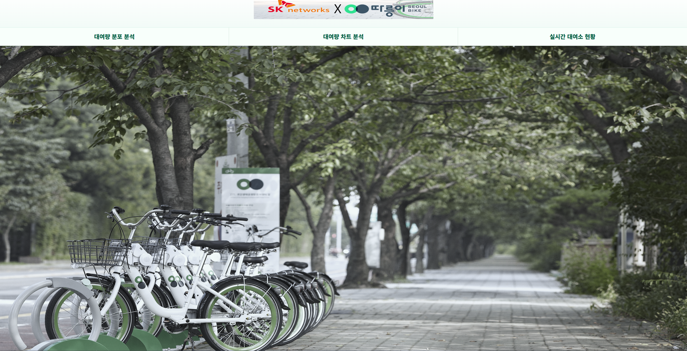
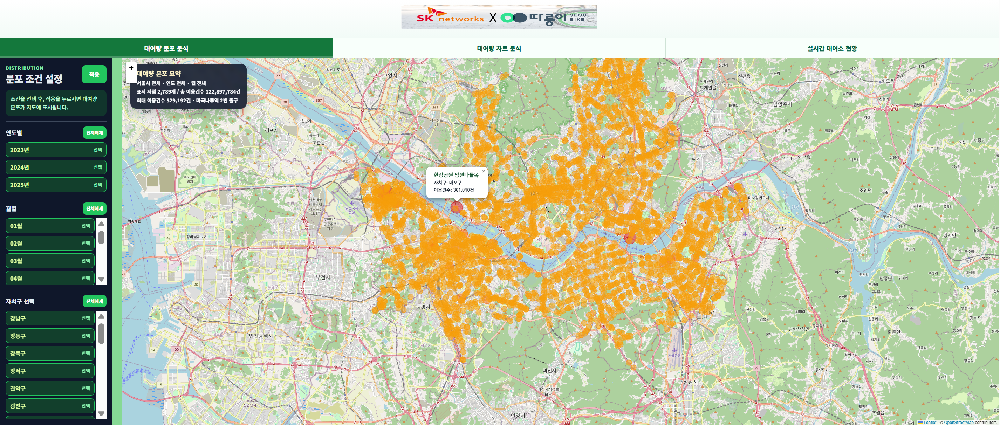
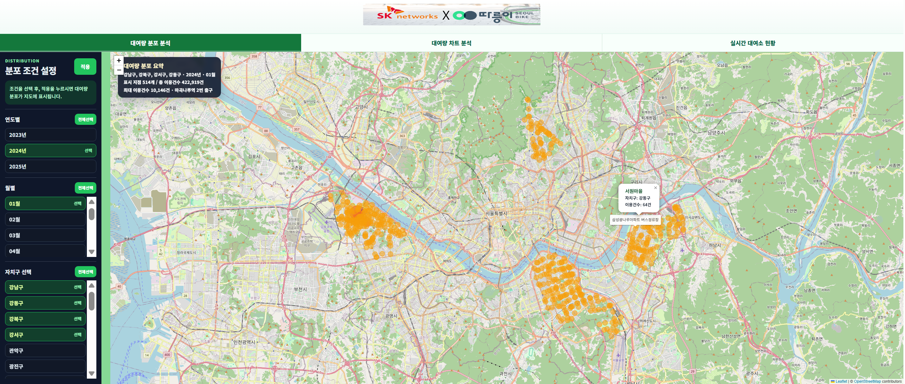
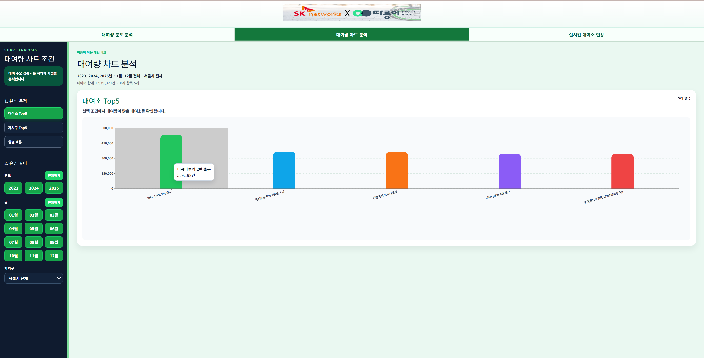
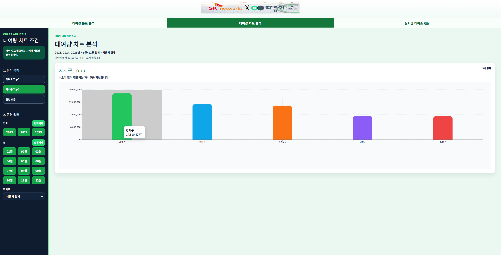
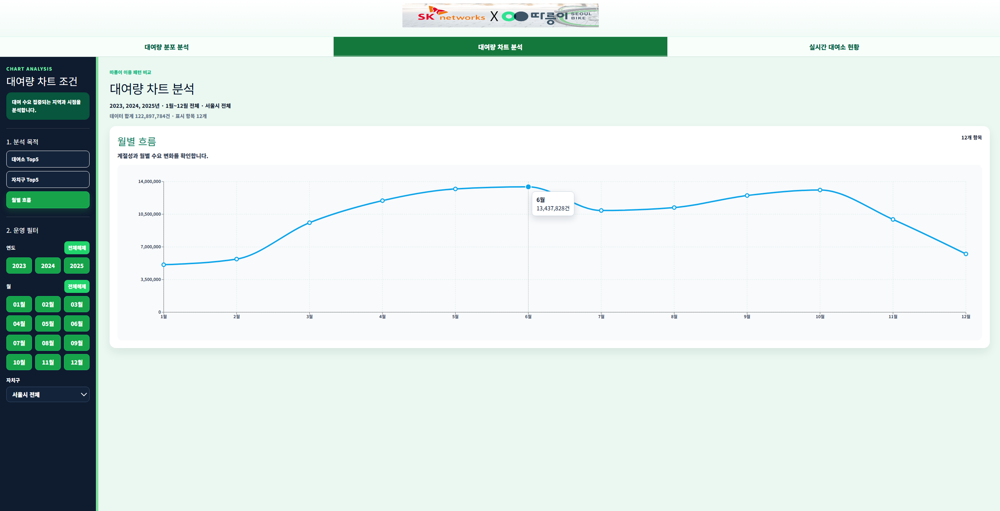
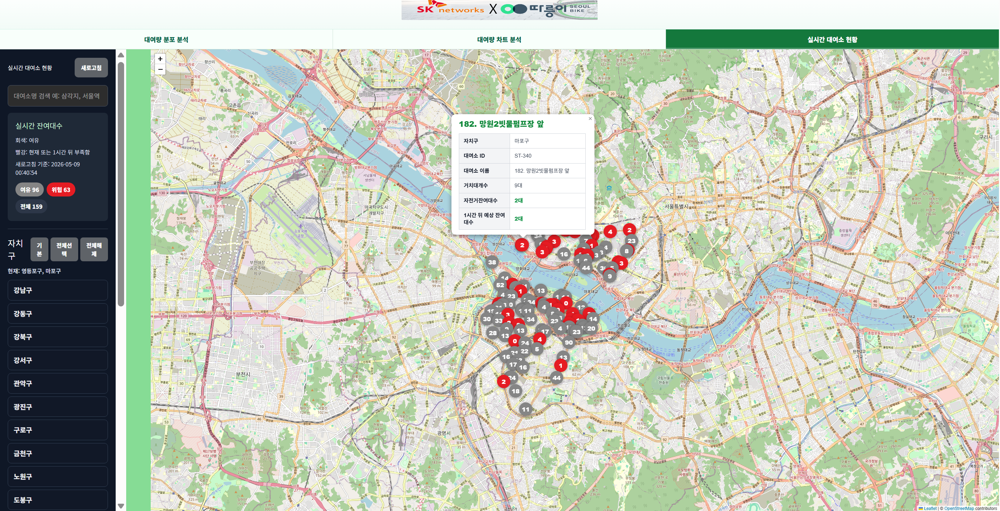
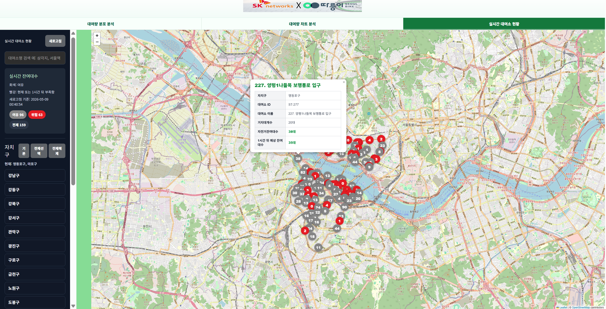

# 서울시 공공자전거 따릉이 대여량 예측

대여소별·시간대별 따릉이 대여량을 예측하여 자전거 재배치와 운영 의사결정을 지원하기 위한 회귀 예측 프로젝트이다.  
본 저장소는 산출물 작성 가이드 형식에 맞춰 데이터 전처리 결과서, 모델 학습 결과서, 학습된 모델 메타데이터를 포함한다.

---

## 평가자 빠른 확인

본 README는 평가자가 프로젝트의 **문제 정의 → 데이터 전처리 → 모델링 → 웹 서비스 구현 → 실행 방법 → 산출물** 흐름을 빠르게 확인할 수 있도록 구성하였다.

### 주요 산출물 바로가기

아래 항목은 평가자가 먼저 확인하면 좋은 핵심 산출물이다.

- **프로젝트 발표 자료**: [PPTX](./docs/SKN29-2nd-5Team.pptx)
  - 프로젝트 개요, 전처리 과정, 피처 설계, 모델 선정, 서비스 화면 시연, 한계점
- **데이터 전처리 결과서**: [전처리 보고서](./docs/1_data_preprocessing_report.md)
  - 원천 데이터, 전처리 방식, 최종 학습 데이터 구성
- **모델 학습 결과서**: [모델 학습 보고서](./docs/2_model_training_report.md)
  - Baseline, XGBoost, LightGBM, GRU 성능 비교 및 최종 모델 선정 근거
- **모델 메타데이터**: [모델 메타데이터](./3_model/model_metadata.md)
  - 최종 모델 환경, 입력 피처, 하이퍼파라미터, 예측 예시
- **웹 서비스 구현 화면**: [웹 서비스 캡처 폴더](./docs/webservice/)
  - 메인 화면, 히트맵, 차트, 실시간 대여소 현황, 1시간 뒤 예측 잔여 대수 화면
- **DB/ERD 문서**: [DB/ERD 폴더](./docs/database/)
  - 서비스용 테이블 구조, ERD, 스키마

### README 목차

1. **프로젝트 개요**: 문제 유형, 예측 대상, 활용 방안
2. **웹 서비스 주요 기능 및 구현 화면**: 실제 구현 화면과 기능 설명
3. **데이터셋 소개**: 사용 데이터, 기간, 학습/검증/테스트 분리
4. **DB/ERD 구조**: 서비스 데이터베이스 구조와 캐시 테이블 활용
5. **전처리 요약**: 타겟 생성, 외부 데이터 결합, 피처 생성
6. **모델링 전략**: 평가 지표와 후보 모델 선정 이유
7. **모델 성능 결과**: Baseline 대비 최종 모델 성능 개선
8~10. **최종 모델 메타데이터·해석·예측 예시**: 모델 재현성과 예측 로직
11~12. **재현 방법·실행 방법**: 로컬 실행 및 API 확인 방법
13. **한계점 및 향후 개선 방향**: 운영 적용 시 보완 과제

---

## 팀원 소개

<table>
  <tr>
    <th align="center">프로필</th>
    <th align="center">이름</th>
    <th align="center">GitHub</th>
    <th align="center">담당 업무</th>
  </tr>
  <tr>
    <td align="center">
      
    </td>
    <td align="center"><b>박준희</b></td>
    <td align="center">
      <a href="https://github.com/hijun318-eng">@hijun318-eng</a>
    </td>
    <td>
      모델 설계 및 하이퍼파라미터 튜닝, GitHub 작성
    </td>
  </tr>
  <tr>
    <td align="center">
      
    </td>
    <td align="center"><b>윤대성</b></td>
    <td align="center">
      <a href="https://github.com/YoonDaeSung-01">@YoonDaeSung-01</a>
    </td>
    <td>
      데이터 전처리 및 모델 설계, 프로젝트 방향성 제시
    </td>
  </tr>
  <tr>
    <td align="center">
      
    </td>
    <td align="center"><b>정승</b></td>
    <td align="center">
      <a href="https://github.com/jseung89">@jseung89</a>
    </td>
    <td>
      모델 설계 및 PPT 제작, 발표
    </td>
  </tr>
  <tr>
    <td align="center">
      
    </td>
    <td align="center"><b>최지용</b></td>
    <td align="center">
      <a href="https://github.com/antisdream">@antisdream</a>
    </td>
    <td>
      모델 설계 및 프론트엔드 & 백엔드 제작, 시연 발표
    </td>
  </tr>
</table>

---

## 🛠️ 사용 기술 및 주요 기능

### Language

| 아이콘 | 이름 | 사용 목적 |
|---|---|---|
|  | Python | 데이터 전처리, 머신러닝 모델 학습, FastAPI 백엔드 구현 |
|  | JavaScript | React 기반 프론트엔드 화면 및 API 연동 구현 |
|  | HTML5 | Vite 기반 웹 페이지 진입 구조 작성 |
|  | CSS3 | 대시보드 레이아웃, 사이드 연동 구현 |
|  | HTML5 | Vite 기반 웹 페이지 진바, 차트 페이지 UI 스타일링 |
|  | SQL | 따릉이 대여량, 대여소, 캐시 테이블 설계 및 조회 |

### Frontend

| 아이콘 | 이름 | 사용 목적 |
|---|---|---|
|  | React | 대여량 분포 분석, 대여량 차트 분석, 실시간 대여소 현황 화면 구현 |
|  | Vite | React 개발 서버 및 프론트엔드 빌드 환경 구성 |
|  | Axios | 프론트엔드와 FastAPI 백엔드 간 HTTP 통신 |
|  | Recharts | 연도별 이용 건수, 월별 흐름, 대여소 Top5, 자치구 Top5 시각화 |
|  | Leaflet | 실시간 대여소 위치 지도 및 마커 시각화 |

### Backend

| 아이콘 | 이름 | 사용 목적 |
|---|---|---|
|  | FastAPI | 대여량 분석, 차트, 실시간 대여소, 예측 API 서버 구현 |
|  | Uvicorn | FastAPI 애플리케이션 실행 서버 |
|  | Pydantic | 환경 변수 및 설정값 관리 |
|  | MySQL | 따릉이 대여 이력, 대여소 정보, 히트맵 캐시 데이터 저장 |
|  | SQLAlchemy | Python 백엔드와 MySQL 데이터베이스 연결 관리 |

### Data Processing & Machine Learning

| 아이콘 | 이름 | 사용 목적 |
|---|---|---|
|  | Pandas | 대여 이력, 날씨, 공휴일, 대여소 데이터 전처리 |
|  | NumPy | 수치 연산 및 모델 입력 데이터 처리 |
|  | Scikit-learn | 모델 학습 데이터 분리, 평가 지표 계산, 전처리 보조 |
|  | XGBoost | 따릉이 대여량 예측 회귀 모델 학습 |
|  | LightGBM | 대여량 예측 모델 비교 및 성능 검증 |
|  | Jupyter Notebook | 데이터 전처리 및 모델링 실험 기록 |
|  | Parquet | 모델 학습용 피처 데이터 저장 |
|  | Joblib / Pickle | 학습된 모델 파일 저장 및 백엔드 로드 |

### External API & Data

| 아이콘 | 이름 | 사용 목적 |
|---|---|---|
|  | 서울 열린데이터광장 API | 실시간 따릉이 대여소 정보 수집 |
|  | 서울시 공공자전거 따릉이 데이터 | 대여 이력 및 대여소 기반 수요 분석 |
|  | 기상 데이터 | 날씨 요인을 반영한 대여량 예측 피처 구성 |
|  | 공휴일 데이터 | 평일, 주말, 공휴일 수요 패턴 반영 |

### Tools

| 아이콘 | 이름 | 사용 목적 |
|---|---|---|
|  | Git | 프로젝트 버전 관리 |
|  | GitHub | 프로젝트 코드 공유 및 협업 |
|  | VS Code | 프론트엔드 및 백엔드 개발 환경 |
|  | MySQL Workbench | ERD 확인 및 데이터베이스 구조 관리 |
|  | npm | 프론트엔드 패키지 설치 및 실행 관리 |

---


## 데이터 및 산출물 전체 구조

```text
SKN29-2nd-5Team/
├── README.md
├── .env
├── .gitignore
│
├── 3_model/
│   ├── best_model.zip
│   └── model_metadata.md
│
├── backend/
│   ├── main.py
│   ├── requirements.txt
│   ├── api/
│   │   ├── __init__.py
│   │   ├── chart.py
│   │   ├── predict.py
│   │   ├── realtime.py
│   │   ├── stats.py
│   │   └── validation.py
│   ├── backend_data/
│   │   ├── bike_2026_final_28features_for_model.parquet
│   │   ├── lgbm_v1.pkl
│   │   ├── xgboost_tuned_v1.pkl
│   │   └── (기타 모델/설정 파일들)
│   ├── core/
│   │   ├── __init__.py
│   │   ├── config.py
│   │   └── database.py
│   ├── database/
│   │   └── schema.sql
│   └── services/
│       ├── __init__.py
│       ├── chart_service.py
│       ├── data_utils.py
│       ├── realtime_service.py
│       └── validation_service.py
│
├── frontend/
│   ├── package.json
│   ├── vite.config.js
│   ├── public/
│   │   ├── home__main.png
│   │   └── home_top.png
│   └── src/
│       ├── main.jsx
│       ├── App.jsx
│       ├── App.css
│       ├── index.css
│       ├── api/
│       │   └── client.js
│       ├── assets/
│       │   ├── hero.png
│       │   ├── react.svg
│       │   └── vite.svg
│       └── pages/
│           ├── ChartPage.jsx
│           ├── HeatmapPage.jsx
│           ├── Home.jsx
│           └── Ttareungyeojido.jsx
│
├── data/
│   ├── raw/
│   │   ├── bike_history/
│   │   ├── holiday/
│   │   ├── station/
│   │   └── weather/
│   └── processed/
│       ├── test_2025_parts/
│       ├── train_2023_parts/
│       └── valid_2024_parts/
│
├── docs/
│   ├── SKN29-2nd-5Team.pptx
│   ├── 1_data_preprocessing_report.md
│   ├── 2_model_training_report.md
│   ├── database/
│   │   ├── bike_db.png
│   │   └── README.md
│   ├── icons/
│   │   └── (기술 스택 아이콘 이미지)
│   ├── team/
│   │   ├── choi_jiyong.png
│   │   ├── jung_seung.png
│   │   ├── park_junhee.png
│   │   └── yoon_daesung.png
│   └── webservice/
│       ├── Homepage1.png
│       ├── Homepage2.png
│       ├── Homepage3.png
│       ├── Homepage4.png
│       ├── Homepage5.png
│       ├── Homepage6.png
│       ├── Homepage7.png
│       └── Homepage8.png
│
├── image/
│   └── 전처리_후_대여량_구간_분포.png
│
└── notebooks/
    ├── 01_preprocessing_pipeline.ipynb
    └── 02_modeling_evaluation.ipynb
```

---

## 1. 프로젝트 개요

| 항목 | 내용 |
|------|------|
| 문제 유형 | 회귀 |
| 예측 대상 | 대여소별 시간 단위 대여량 `rental_count` |
| 활용 방안 | 특정 대여소, 날짜, 시간 조건의 예상 대여량을 예측하여 운영 의사결정에 활용 |
| 성공 기준 | 최종 모델이 Baseline 대비 MAE, RMSE, WAPE는 낮고 R2는 높을 것 |

따릉이 대여 수요는 시간대, 요일, 계절, 날씨, 대여소 위치에 따라 크게 달라진다. 본 프로젝트는 공개 데이터를 기반으로 대여소별·시간대별 미래 대여량을 예측할 수 있는 학습 데이터셋과 모델을 구축하였다.

프로젝트 발표 자료는 [`docs/SKN29-2nd-5Team.pptx`](./docs/SKN29-2nd-5Team.pptx)에 정리되어 있으며, 발표 흐름은 프로젝트 개요, 데이터 전처리, 피처 선정, 모델 선정, 서비스 화면 시연, 모델 예측 결과 및 한계점 순서로 구성되어 있다.

---

## 2. 웹 서비스 주요 기능 및 구현 화면

본 프로젝트는 **React 기반 프론트엔드**와 **FastAPI 백엔드**를 연동하여 따릉이 대여량 분석, 차트 시각화, 실시간 대여소 현황, 1시간 뒤 예상 잔여 대수 확인 기능을 제공한다.

### 기능 요약

- **메인 화면**
  - 설명: 프로젝트 서비스 진입 화면
  - 주요 데이터 및 기능: 서비스 메뉴 이동, 메인 비주얼
- **대여량 분포 분석**
  - 설명: 연도, 월, 자치구 조건에 따른 따릉이 대여량 히트맵 시각화
  - 주요 데이터 및 기능: `bike_usage_heatmap_cache`, Leaflet 지도
- **대여량 차트 분석**
  - 설명: 대여소 Top5, 자치구 Top5, 월별 흐름 시각화
  - 주요 데이터 및 기능: `bike_usage_heatmap_cache`, Recharts
- **실시간 대여소 현황**
  - 설명: 서울시 실시간 따릉이 API 기반 대여소 상태 지도 표시
  - 주요 데이터 및 기능: 서울 열린데이터광장 API, `bike_markers`
- **1시간 뒤 예측 잔여 수**
  - 설명: 실시간 자전거 보유 수와 학습 모델 예측 결과를 결합하여 예상 잔여 대수 제공
  - 주요 데이터 및 기능: 실시간 API, XGBoost 모델

> 발표 및 시연 단계에서는 SQL에 적재한 데이터를 `bike_usage_heatmap_cache`로 집계하여 빠르게 시각화하였다. 실제 배포 환경에서는 운영 DB에 적재된 최신 데이터를 기준으로 캐시를 갱신하여 사용하는 구조를 목표로 한다.

### 2-1. 메인 화면

서비스에 접속했을 때 가장 먼저 보이는 화면이다. 상단 메뉴를 통해 **대여량 분포 분석**, **대여량 차트 분석**, **실시간 대여소 현황** 페이지로 이동할 수 있다.

<p align="center">
  
</p>

### 2-2. 대여량 분포 분석 - 전체 조건 기준 히트맵

연도, 월, 자치구 조건을 선택하여 서울시 따릉이 대여량 분포를 지도 위에서 확인할 수 있다. 선택한 조건에 따라 대여량이 많은 지역이 히트맵 형태로 표시된다.

<p align="center">
  
</p>

### 2-3. 대여량 분포 분석 - 조건 필터 적용 화면

특정 연도, 월, 자치구를 필터링하면 선택 조건에 해당하는 대여소와 대여량 분포만 지도에 표시된다. 이를 통해 지역별·시기별 따릉이 이용 패턴을 비교할 수 있다.

<p align="center">
  
</p>

### 2-4. 대여량 차트 분석 - 대여소 Top5

선택한 조건에서 대여량이 높은 대여소 상위 5개를 막대차트로 제공한다. 특정 기간에 이용량이 집중되는 대여소를 빠르게 확인할 수 있다.

<p align="center">
  
</p>

### 2-5. 대여량 차트 분석 - 자치구 Top5

선택한 조건에서 대여량이 높은 자치구 상위 5개를 막대차트로 제공한다. 자치구 단위로 따릉이 이용량 차이를 비교할 수 있다.

<p align="center">
  
</p>

### 2-6. 대여량 차트 분석 - 월별 흐름

연도별·월별 누적 대여량 흐름을 꺾은선 그래프로 제공한다. 계절, 월별 이용량 변화와 수요 패턴을 직관적으로 확인할 수 있다.

<p align="center">
  
</p>

### 2-7. 실시간 대여소 현황 - 현재 잔여 대수 확인

서울시 실시간 따릉이 API를 호출하여 대여소별 현재 거치 대수, 거치율, 대여 가능 상태를 지도 마커로 표시한다. 마커를 클릭하면 대여소 상세 정보가 팝업으로 제공된다.

<p align="center">
  
</p>

### 2-8. 실시간 대여소 현황 - 1시간 뒤 예상 잔여 대수

현재 잔여 대수와 대여소 정보를 기반으로 머신러닝 모델 예측 결과를 결합하여 **1시간 뒤 예상 잔여 대수**를 함께 제공한다. 이를 통해 대여소 운영 및 재배치 의사결정에 활용할 수 있다.

<p align="center">
  
</p>

---

## 3. 데이터셋 소개

### 원천 데이터 구성

- **따릉이 대여 이력**
  - 원천 파일: `data/raw/bike_history/{year}/bike_history_YYYY_MM.parquet`
  - 기간 또는 범위: 2023년 ~ 2025년, 월별 parquet 36개
  - 주요 역할: 대여소·날짜·시간 단위 `rental_count` 생성
- **대여소 정보**
  - 원천 파일: `data/raw/station/station_master.csv`, `station_info.xlsx`
  - 기간 또는 범위: 대여소 마스터 3,417건
  - 주요 역할: 위도, 경도, 주소, 대여소 속성 결합
- **날씨 정보**
  - 원천 파일: `data/raw/weather/{year}/asos_seoul_108_*.csv`
  - 기간 또는 범위: 2018-12-25 ~ 2026-03-31
  - 주요 역할: 기온, 습도, 풍속, 강수량 결합
- **공휴일 정보**
  - 원천 파일: `data/raw/holiday/holiday_2019_2026.csv`
  - 기간 또는 범위: 2019년 ~ 2026년, 150건
  - 주요 역할: 공휴일 여부와 주말 여부를 결합해 `is_day_off` 생성

최종 학습 데이터는 원본 개별 대여 기록을 대여소·날짜·시간 단위로 집계한 회귀 예측 데이터셋이다.

| 구분 | 기간 | 행 수 | 타겟 합계 | 평균 대여량 | 0 대여량 비율 |
|------|------|------:|------:|------:|------:|
| Train | 2023년 | 23,459,991 | 44,282,784 | 1.888 | 0.451 |
| Validation | 2024년 | 23,818,357 | 43,494,512 | 1.826 | 0.455 |
| Test | 2025년 | 22,977,771 | 36,314,496 | 1.580 | 0.485 |

---

## 4. DB/ERD 구조

### 데이터베이스 구조

본 프로젝트는 분석 및 시각화를 위해 아래 3개 테이블을 사용한다.

- `bike_markers`
  - 대여소 ID, 이름, 자치구, 주소, 위도, 경도, 거치대 수량을 저장하는 대여소 마스터 테이블
- `bike_usage`
  - 대여소별 실제 대여 이력과 날짜, 시간, 자치구, 좌표, 적설 여부 등을 저장하는 대여 이력 테이블
- `bike_usage_heatmap_cache`
  - 프론트엔드 히트맵과 차트 페이지를 빠르게 표시하기 위해 연도·월·대여소 단위로 미리 집계한 캐시 테이블

ERD와 스키마 파일은 아래 위치에 정리한다.

- [ERD 이미지](./docs/database/bike_db.png): `docs/database/bike_db.png`
- [DB 테이블 생성 스키마](./docs/database/bike_db.sql): `docs/database/bike_db.sql`
- [테이블 및 컬럼 설명 문서](./docs/database/bike_db.md): `docs/database/bike_db.md`

`bike_usage_heatmap_cache`는 히트맵 전용 캐시로 시작했지만, 최종 서비스에서는 차트 페이지에서도 함께 사용한다.  
따라서 차트 페이지는 원본 전체 이력 테이블을 매번 직접 집계하지 않고, 이미 집계된 캐시 데이터를 기반으로 빠르게 대여소 Top5, 자치구 Top5, 월별 흐름을 계산한다.

---

## 5. 전처리 요약

원본 대여 이력은 개별 자전거 대여 및 반납 기록 단위이므로, 모델 학습을 위해 대여소·날짜·시간 단위로 재집계하였다.

주요 전처리 내용:

- `대여일시`, `대여대여소ID`를 기준으로 대여량 집계
- 대여가 없는 시간대도 `rental_count = 0`으로 포함
- 대여소 정보, 날씨 정보, 공휴일 정보를 외부 변수로 결합
- 미매칭 대여소 58개 제거
- 반납일시, 반납대여소, 이용시간, 이용거리 등 예측 시점 이후에 알 수 있는 정보 제거
- 시간 주기성, lag, rolling, diff 계열 파생 변수 생성
- 트리 기반 회귀 모델을 사용하므로 별도 스케일링은 적용하지 않음

최종 입력 피처는 28개이며, 타겟 변수는 `rental_count`이다.

| 피처 그룹 | 최종 입력 특성 |
|-----------|----------------|
| 대여소 정보 | `station_id`, `latitude`, `longitude`, `rack_count`, `station_age_days` |
| 시간 정보 | `month`, `day`, `hour`, `dayofweek`, `hour_sin`, `hour_cos` |
| 쉬는 날 정보 | `is_day_off` |
| 날씨 정보 | `temperature`, `humidity`, `wind_speed`, `precipitation` |
| 과거 대여량 Lag | `lag_1`, `lag_2`, `lag_3`, `lag_24`, `lag_48`, `lag_168` |
| 이동 평균 | `rolling_mean_3`, `rolling_mean_6`, `rolling_mean_24` |
| 변동성 | `rolling_std_24` |
| 변화량 | `diff_1`, `diff_24` |

저장 파일:

| 구분 | 저장 위치 |
|------|----------|
| Train 데이터 | `data/processed/train_2023_parts/train_2023_part_*.parquet` |
| Validation 데이터 | `data/processed/valid_2024_parts/valid_2024_part_*.parquet` |
| Test 데이터 | `data/processed/test_2025_parts/test_2025_part_*.parquet` |

---

## 6. 모델링 전략

평가 지표는 회귀 문제에 맞춰 MAE, RMSE, WAPE, R2를 사용하였다.

| 지표 | 사용 목적 |
|------|-----------|
| MAE | 평균적으로 몇 대 정도 예측이 틀리는지 확인 |
| RMSE | 큰 예측 오차를 더 민감하게 확인 |
| WAPE | 전체 실제 대여량 대비 오차 비율 확인 |
| R2 | 실제 대여량 변동 설명력 확인 |

후보 모델:

| 모델 | 선정 이유 |
|------|-----------|
| Baseline | 평균 및 과거 동일 시간대 기반 기준 성능 확인 |
| XGBoost | 정형 데이터와 비선형 관계 학습에 강하며 Poisson 목적 함수 적용 가능 |
| LightGBM | 대용량 정형 데이터 학습 속도가 빠른 부스팅 계열 모델 |
| GRU | 직전 24시간 흐름을 sequence로 학습하는 시계열 대안 모델 |

---

## 7. 모델 성능 결과

### Baseline 성능, Test 기준

| 모델 | MAE | RMSE | WAPE | R2 |
|------|------:|------:|------:|------:|
| 대여소·시간대·휴일 여부 평균 | 1.2635 | 2.1827 | 0.7995 | 0.4791 |
| 대여소·시간대·요일 평균 | 1.2817 | 2.2268 | 0.8110 | 0.4579 |
| 전체 평균 | 1.8894 | 3.0398 | 1.1955 | -0.0103 |

### 최종 모델 비교, Test 기준

| 모델 | MAE | RMSE | WAPE | R2 |
|------|------:|------:|------:|------:|
| Baseline 최우수 모델 | 1.2635 | 2.1827 | 0.7995 | 0.4791 |
| XGBoost 기본 모델 | 0.9503 | 1.6152 | 0.6013 | 0.7148 |
| XGBoost 튜닝 후보 1 | **0.9457** | **1.6086** | **0.5984** | **0.7171** |
| XGBoost 튜닝 후보 2 | 0.9480 | 1.6091 | 0.5998 | 0.7169 |
| XGBoost 튜닝 후보 3 | 0.9486 | 1.6103 | 0.6003 | 0.7165 |
| LightGBM | 0.9484 | 1.6125 | 0.6001 | 0.7157 |
| GRU | 0.9678 | 1.7021 | 0.6114 | 0.6839 |

최종 선정 모델은 **XGBoost 튜닝 모델**이다. Test 기준 모든 핵심 지표에서 가장 우수했고, Baseline 최우수 모델 대비 MAE 약 25.2%, RMSE 약 26.3%, WAPE 약 25.2%를 개선하였다.

---

## 8. 최종 모델 메타데이터

| 항목 | 내용 |
|------|------|
| 모델명 | XGBoost Regressor |
| 버전 | v1.0.0 |
| 저장일 | 2026-05-02 |
| 작성자 | 프로젝트 5 팀 |
| 모델 파일 | `3_model/best_model.zip` 내부 `xgboost_tuned_v1.pkl` |
| 입력 특성 수 | 28개 |
| 타겟 변수 | `rental_count` |

학습 환경:

| 항목 | 버전 |
|------|------|
| Python | 3.13.5 |
| scikit-learn | 1.8.0 |
| xgboost | 3.1.3 |
| pandas | 2.2.3 |
| numpy | 2.3.5 |

최종 하이퍼파라미터:

| 파라미터 | 값 |
|---------|-----|
| objective | `count:poisson` |
| eval_metric | `rmse` |
| learning_rate | 0.03 |
| max_depth | 10 |
| min_child_weight | 30 |
| subsample | 0.8 |
| colsample_bytree | 0.8 |
| reg_alpha | 0.3 |
| reg_lambda | 2.0 |
| gamma | 0.1 |
| n_estimators | 3000 |
| random_state | 42 |

---

## 9. 모델 해석

최종 XGBoost 모델에서 중요한 변수는 대부분 과거 대여량과 시간 패턴 관련 변수였다.

| 순위 | 특성명 | 중요도 | 해석 |
|------|--------|------:|------|
| 1 | `lag_1` | 0.5212 | 직전 1시간 대여량이 현재 수요 예측에 가장 큰 영향을 미침 |
| 2 | `lag_168` | 0.1458 | 일주일 전 같은 시간대 패턴 반영 |
| 3 | `rolling_mean_3` | 0.1089 | 최근 3시간 평균 수요 흐름 반영 |
| 4 | `lag_24` | 0.0765 | 하루 전 같은 시간대 수요 반영 |
| 5 | `precipitation` | 0.0254 | 강수량에 따른 자전거 이용 변화 반영 |

대여량이 증가할 가능성이 높은 조건은 직전 수요가 높고, 하루 전·일주일 전 같은 시간대 수요가 높으며, 비가 적고, 출퇴근 등 특정 시간대 패턴이 뚜렷한 경우로 해석할 수 있다.

---

## 10. 모델 로드 및 예측 예시

`best_model.zip` 압축을 해제하면 `xgboost_tuned_v1.pkl`을 사용할 수 있다. pkl 파일은 `pickle`로 직렬화된 객체이며, 내부에 `model`과 `feature_cols`를 포함한다.

```python
import pickle
import pandas as pd

with open("3_model/xgboost_tuned_v1.pkl", "rb") as f:
    model_package = pickle.load(f)

model = model_package["model"]
feature_cols = model_package["feature_cols"]

new_data = pd.DataFrame([
    {
        "station_id": 101,
        "latitude": 37.55,
        "longitude": 126.98,
        "rack_count": 15,
        "station_age_days": 1000,
        "month": 5,
        "day": 3,
        "hour": 18,
        "dayofweek": 5,
        "is_day_off": 1,
        "hour_sin": -1.0,
        "hour_cos": 0.0,
        "temperature": 20.0,
        "humidity": 60.0,
        "wind_speed": 2.0,
        "precipitation": 0.0,
        "lag_1": 5,
        "lag_2": 4,
        "lag_3": 4,
        "lag_24": 6,
        "lag_48": 5,
        "lag_168": 7,
        "rolling_mean_3": 4.33,
        "rolling_mean_6": 4.80,
        "rolling_mean_24": 5.20,
        "rolling_std_24": 2.10,
        "diff_1": 1,
        "diff_24": -1
    }
])

X = new_data[feature_cols]
prediction = max(0, float(model.predict(X)[0]))

print(f"예상 대여량: {prediction:.2f}건")
print(f"화면 표시용 예상 대여량: {round(prediction)}대")
```

---

## 11. 재현 방법

1. `data/raw/`에 대여 이력, 대여소, 날씨, 공휴일 데이터를 준비한다.
2. `notebooks/01_preprocessing_pipeline.ipynb`를 실행하여 전처리 데이터를 생성한다.
3. 생성된 parquet part 파일을 `data/processed/` 하위에 저장한다.
4. 2023년은 Train, 2024년은 Validation, 2025년은 Test로 사용한다.
5. `notebooks/02_modeling_evaluation.ipynb` 또는 동일한 학습 코드를 실행한다.
6. XGBoost Regressor를 학습하고 Validation/Test 기준 MAE, RMSE, WAPE, R2를 평가한다.
7. 최종 모델을 `xgboost_tuned_v1.pkl`로 저장하고 `3_model/best_model.zip`에 패키징한다.

---
## 12. 실행 방법

### 1. 백엔드 실행

```bash
cd backend
python -m venv ml_env
ml_env\Scripts\activate
pip install -r requirements.txt
uvicorn main:app --reload
```

백엔드 기본 주소는 아래와 같다.

```text
http://127.0.0.1:8000
```

### 2. 프론트엔드 실행

```bash
cd frontend
npm run build
npm run node server.js
```

프론트엔드 기본 주소는 아래와 같다.

```text
http://localhost:4173
```

### 3. 주요 API 예시

| 기능 | API 예시 |
|---|---|
| 히트맵 데이터 | `/api/stats/heatmap` |
| 차트 데이터 | `/api/chart/cache-dashboard` |
| 실시간 대여소 현황 | `/api/realtime/bike` |
| 서버 상태 확인 | `/api/admin/heatmap-cache-status` |

실시간 대여소 현황 API는 서울시 실시간 따릉이 API 결과와 내부 대여소 마스터 데이터를 매핑한다.  
추가로 학습 모델을 이용해 현재 조건 기준 1시간 뒤 예상 자전거 잔여 수를 계산하여 프론트엔드에 제공한다.

---

## 13. 한계점 및 향후 개선 방향

한계점:

- 대여소 마스터와 매칭되지 않는 일부 대여소 58개를 제거하였다.
- 날씨 데이터는 서울 관측 지점 기준이므로 개별 대여소 주변의 미세한 날씨 차이를 완전히 반영하지 못한다.
- `rental_count = 0`인 시간대가 많아 낮은 수요 구간의 예측 난이도가 높다.
- lag, rolling, diff 계열 피처는 운영 환경에서 과거 대여 이력 DB를 기반으로 실시간 생성되어야 한다.
- 실시간 자전거 보유량, 거치 가능 수, 재배치 이력, 고장/수리 정보 등 운영 데이터는 충분히 반영하지 못하였다.

향후 개선 방향:

- 2026년 이후 최신 데이터 구조를 정리하여 정기 재학습 수행
- 실시간 재고, 재배치, 고장/수리, 민원 데이터 등 운영 변수 추가
- 대여소 단위의 더 세밀한 날씨·지역 이벤트 데이터 결합
- SHAP 분석을 추가하여 변수 영향 방향과 개별 예측 근거 강화

---

## 참고 산출물

최종 제출물 기준으로 산출물을 다시 한 번 점검할 수 있도록 정리하였다. 화면이 길어지지 않도록 상세 목록은 접기/펼치기 형태로 구성하였다.

<details>
<summary><b>참고 산출물 상세 목록 보기</b></summary>

- **프로젝트 발표 자료**
  - 파일: [`docs/SKN29-2nd-5Team.pptx`](./docs/SKN29-2nd-5Team.pptx)
  - 설명: 프로젝트 발표 자료, 서비스 시연 화면, 모델 예측 결과 및 한계점 정리
- **데이터 전처리 결과서**
  - 파일: [`docs/1_data_preprocessing_report.md`](./docs/1_data_preprocessing_report.md)
  - 설명: 데이터셋 소개, EDA, 전처리, 데이터 분리 결과
- **모델 학습 결과서**
  - 파일: [`docs/2_model_training_report.md`](./docs/2_model_training_report.md)
  - 설명: 모델링 전략, 후보 모델 성능, 최종 모델 선정
- **모델 메타데이터**
  - 파일: [`3_model/model_metadata.md`](./3_model/model_metadata.md)
  - 설명: 최종 모델 환경, 하이퍼파라미터, 입력 스펙, 예측 예시
- **서비스 데이터베이스 ERD 이미지**
  - 파일: [`docs/database/bike_db.png`](./docs/database/bike_db.png)
  - 설명: 서비스 데이터베이스 ERD 이미지
- **웹 서비스 구현 화면 캡처**
  - 파일: [`docs/webservice/Homepage1.png`](./docs/webservice/Homepage1.png) ~ `Homepage8.png`
  - 설명: 웹 서비스 구현 화면 캡처

</details>
